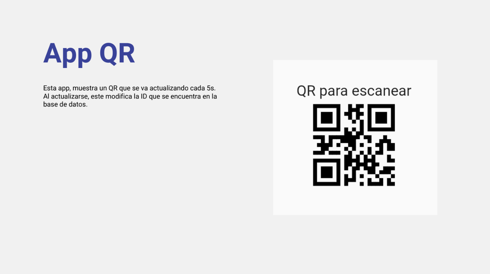
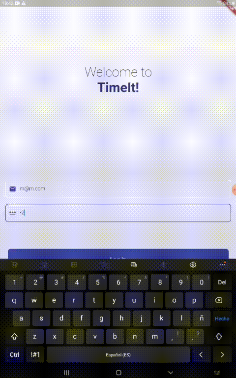
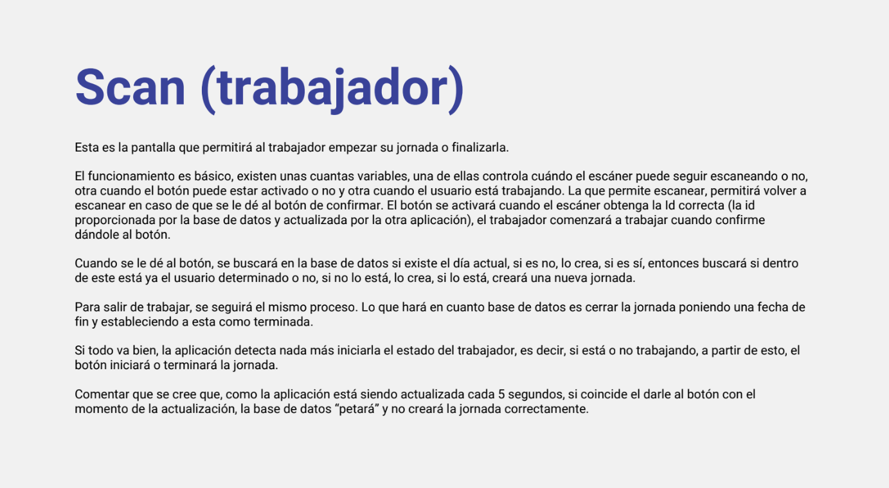
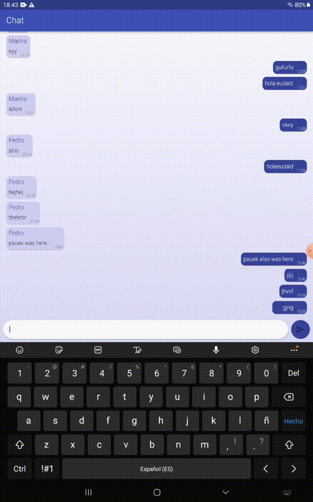
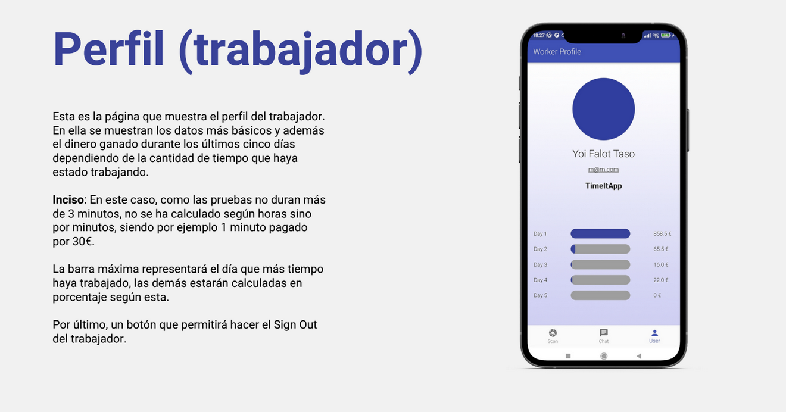
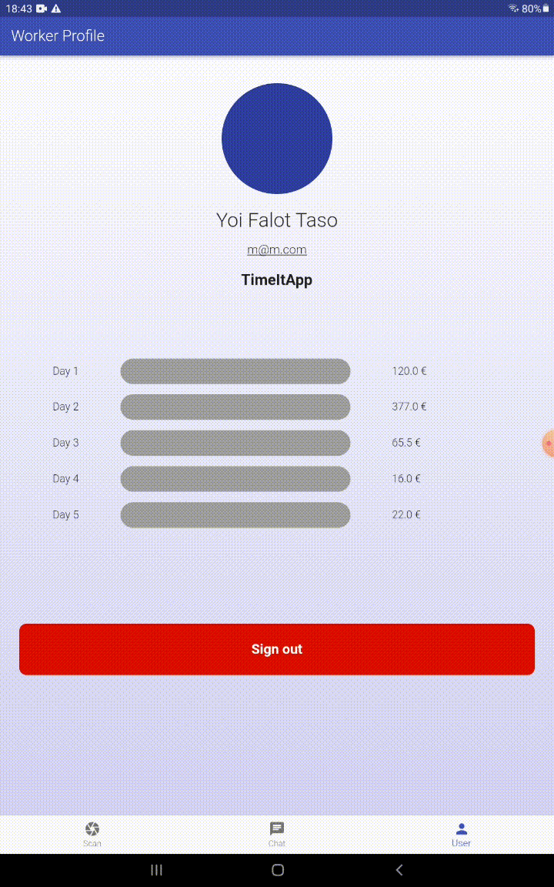
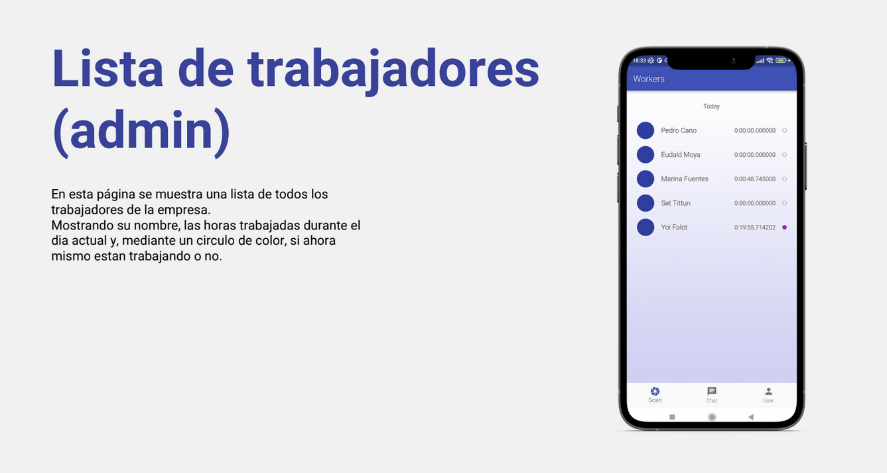
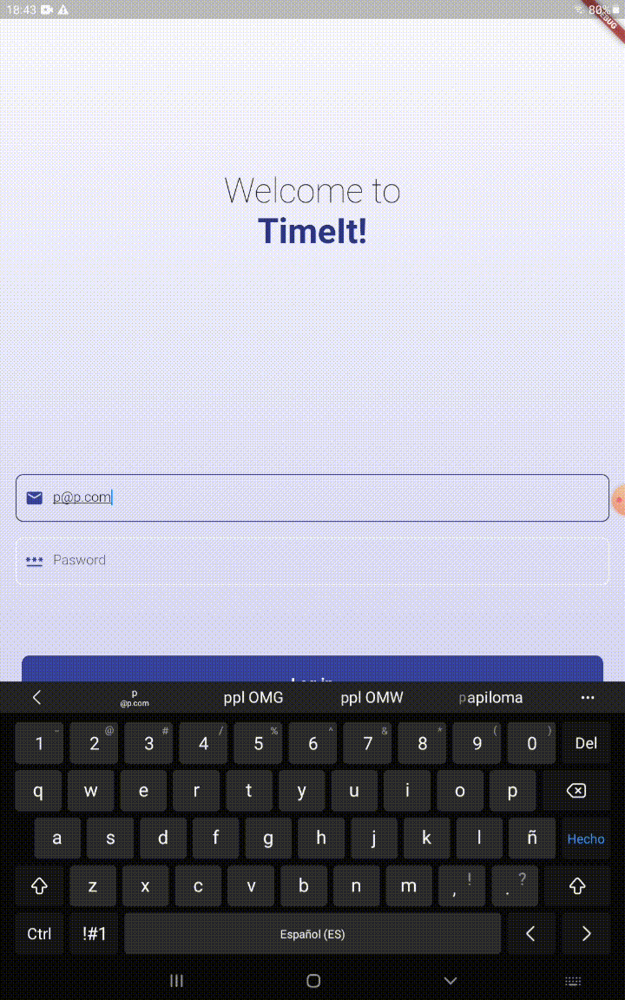

# TimeIt App

This is an app coded with Flutter to keep track of your empoloyee's working time. 
Consists of 2 apps:
  - A small app with a QR code that changes its ID every 30 seconds and sends it to a Firebase database. 
  - The main app that has 2 different kinds of accounts (employee, admin).
    - Employee:
      - Scan: camera to scan the QR and a confirmation button to start the day. Same to finish the day.
      - Chat: Group chat with all other employees
      - Profile: Shows personal information and a list of the money earned during the last 7 days.
    - Admin:
      - List of employees: Shows a list of all employees, if they are working at the moment and for how long they have been working on that day.
      - Chat: Group chat with all employees
      - Profile: Shows personal information and gives you the possiblity to add now employees.

### Log in

### Scan

### Chat

### Profile Worker

### Admin

